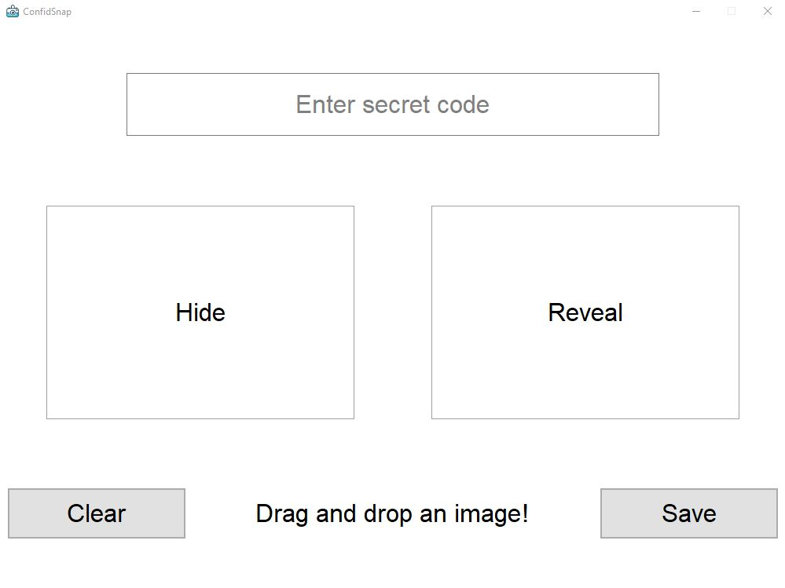
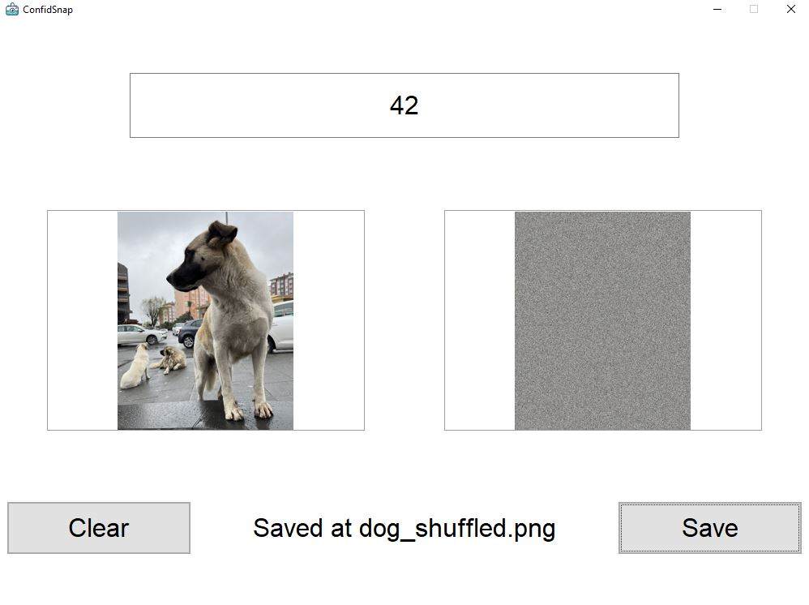
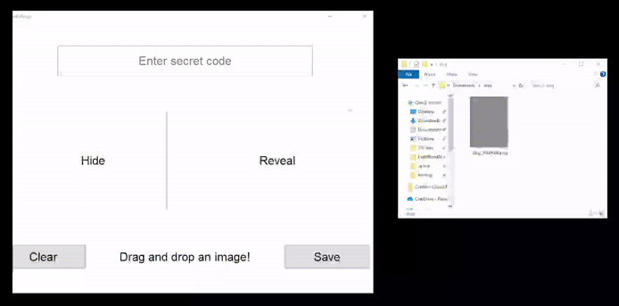

# ConfidSnap

ConfidSnap is a secure application that allows you to safely share sensitive images by shuffling and unshuffling the pixels based on a secret code. This ensures that the original image content remains hidden unless the correct code is used.

## Features

- **Drag and Drop**: Easily drag and drop images into the application.
- **Secret Code**: Use a secret code to shuffle and unshuffle the pixels of an image.
- **Clear and Save**: Clear the images from the application or save the processed image.

## Installation

1. **Clone the Repository**:
   ```bash
   git clone https://github.com/cengizozel/ConfidSnap.git
   cd confidsnap
   ```

2. **Install Dependencies**:
   Make sure you have Python and pip installed. Then, install the required libraries:
   ```bash
   pip install tkinterdnd2 Pillow numpy
   ```

3. **Run the Application**:
   ```bash
   python confidsnap.py
   ```

## Usage

1. **Launch ConfidSnap**: Run the application using the command above.
2. **Enter Secret Code**: Type a secret code in the entry box. This code will be used to shuffle and unshuffle the image.
3. **Drag and Drop**: Drag and drop an image into the "Hide" or "Reveal" box.
   - **Hide Box**: Shuffled image will appear in the "Reveal" box.
   - **Reveal Box**: The shuffled image will be unshuffled using the secret code and displayed in the "Hide" box.
4. **Clear Images**: Click the "Clear" button to remove the images from the application.
5. **Save Image**: Click the "Save" button to save the processed image.

## Executable

An executable version of the application is available in the `dist` folder for easy deployment.

## Screenshots



